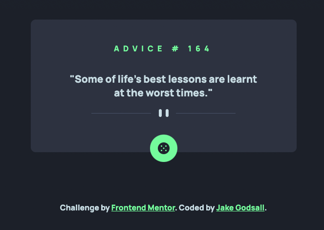

# Advice Generator App (Frontend Mentor)

This is a solution to the [Advice generator app challenge on Frontend Mentor](https://www.frontendmentor.io/challenges/advice-generator-app-QdUG-13db).
Frontend Mentor challenges help you improve your coding skills by building realistic projects.

## Overview

### The challenge

Users should be able to:

&#9745; View the optimal layout for the app depending on their device's screen size

&#9745; See hover states for all interactive elements on the page

&#9745; Generate a new piece of advice by clicking the dice icon

### Extra features added

&#9745; Scripts using both the XMLHttpRequest object and the Fetch API.

&#9745; Disabled the button for the duration of caching to allow for better UX.

&#9745; Added loading animation to the button during its disabled period.

&#9745; Smooth transitions of advice text content.

### Screenshot

### Links

-   Live Site URL: [Netlify](https://jakegodsall-advice-generator.netlify.app/)

## My process

### Built with

-   Semantic HTML5 markup
-   CSS custom properties
-   Flexbox
-   SASS
-   7-1 SASS Architecture
-   Mobile-first workflow
-   XMLHttpRequest

### What I learned

-   This is the first project I have worked on involving external API's. I understand that the
    XMLHttpRequest object is a somewhat outdated solution to asynchronous data retrieval, but I
    wanted to understand how it all works from the ground up.

-   I learned about the `Cache-Control` HTTP headerfield and its corresponding `max-age` directive.

### Useful resources

-   [MDN Web Docs](https://developer.mozilla.org/en-US/docs/Web/HTTP/Headers/Cache-Control) Cache-Control HTTP Header

## Author

-   Website - [Jake Godsall](https://jakegodsall.com)
-   Frontend Mentor - [@jakegodsall](https://www.frontendmentor.io/profile/jakegodsall)
-   LinkedIn - [@godsalljake](https://www.linkedin.com/in/godsalljake/)

## Acknowledgments

I received significant advice regarding the caching of API responses from
[Alexander Morse](https://github.com/Sakeran) on Frontend Mentor.

### Notes

This project was originally completed on 23rd September 2022.

This repository is part of a series of repositories that have recently been cleaned and updated as part of an overhaul of my GitHub profile. The purpose of this overhaul was to ensure that each repository reflects my current development standards and practices, and to provide a cleaner, more professional appearance.

The project is updated as of 28th December 2023.

## License

This project is open source and available under the [MIT License](https://github.com/jakegodsall/fm-advice-generator/blob/main/LICENSE).
